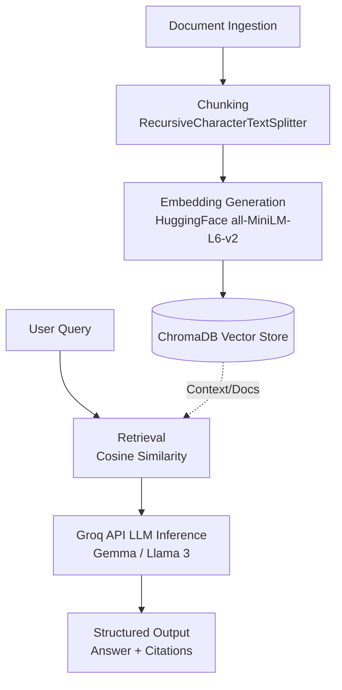

# RAG-tut (Retrieval-Augmented Generation Pipeline)


## Project Overview

A fully functional, local Retrieval-Augmented Generation (RAG) pipeline built from scratch in Python. The system ingests local documents, generates vector embeddings, stores them in a local vector database, and leverages a cloud-based LLM to answer questions. Responses are generated strictly based on the provided context, complete with source citations and confidence scores.

## Architecture

The diagram below illustrates the end-to-end data flow and execution pipeline for the RAG architecture:



## Technical Stack

- **Language:** Python
- **Environment Management:** `uv` (Fast Python package manager)
- **Framework:** LangChain (Document Loaders, Text Splitters, Prompt Templates)
- **Embeddings:** HuggingFace `sentence-transformers` (`all-MiniLM-L6-v2`, 384 dimensions)
- **Vector Database:** ChromaDB (Persistent local storage)
- **LLM Inference:** Groq API (High-speed inference using models like Gemma/Llama 3)

## Key Features

- **Smart Document Chunking:** Implements semantic segment boundaries via LangChain's `RecursiveCharacterTextSplitter` to maintain context integrity.
- **Semantic Similarity Search:** Leverages cosine distance for efficient top-k retrieval of highly relevant document vectors.
- **Hallucination Prevention:** Enforces strict boundary conditions via highly structured system prompting to ensure the LLM answers *only* from retrieved context.
- **Auditable Outputs:** API-like structured responses returning transparent source citations alongside the final answer.

## Getting Started

Follow these steps to set up the pipeline locally. 

### 1. Initialize the Environment
We use `uv` for lightning-fast virtual environment management.
```bash
# Create a virtual environment
uv venv

# Activate the virtual environment
# Windows:
.venv\Scripts\activate
# Linux/macOS:
source .venv/bin/activate
```

### 2. Install Dependencies
```bash
# Install required packages
uv pip install -r requirements.txt
```

### 3. Environment Configuration
Create a `.env` file in the root directory and add your Groq API key:
```env
GROQ_API_KEY=your_groq_api_key_here
```

### 4. Run the Pipeline
Ensure your environment is active, then execute the main application:
```bash
python app.py
```
